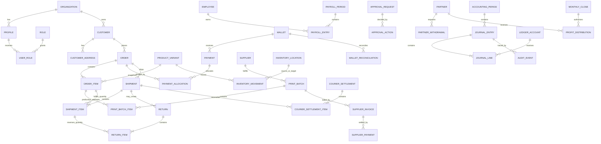

# Domain Model

## Bounded domains

| Domain | Owns | Does not own |
|---|---|---|
| Identity and Access | profiles, roles, assignments, permission checks | Business approval decisions |
| Customers | customer identity and addresses | Order financial snapshots |
| Catalog | products, variants, phone models, effective prices | Historical order cost |
| Orders | order/item snapshots, totals, lifecycle, exceptions | Cash or general-ledger truth |
| Payments | receipts, refunds, allocations, clearing state | Revenue recognition |
| Printing | batches, batch items, QC, supplier invoices/payments | Falcon wallet balance truth |
| Inventory | locations, custody, quantity/value movements | Supplier contract terms |
| Shipping | shipments, returns, rates, courier settlements | Product revenue policy |
| Finance and Ledger | accounts, entries, lines, periods, posting mappings | Operational workflow detail |
| Wallets and Expenses | wallets, transfers, reconciliations, expenses | Partner profit entitlement |
| Payroll | employees, performance, bonuses, payroll accrual/payment | Partner ownership |
| Partners | capital, loans, withdrawals, profit allocations | Operating expenses |
| Approvals | requests, actions, SoD and thresholds | Domain-specific calculations |
| Audit and Attachments | append-only events, evidence metadata/outbox | Authorization source of truth |
| Reporting | read models/views with as-of/freshness | Posting or state mutation |

## Conceptual ERD

## Aggregate and transaction boundaries

- **Order aggregate:** order, item snapshots, payment policy, discount, exception, and status history. Financial side effects occur only through commands.
- **Payment aggregate:** payment plus allocations and posting. Recording is atomic and idempotent.
- **Print batch aggregate:** each `print_batch_item` is a production attempt for an order item, with requested/sent/received/accepted/rejected/lost quantities and optional failed-attempt/reprint reference. An order item may have many attempts. Payment is a separate command locked to accepted receipt/QC and invoice.
- **Shipment/settlement aggregate:** `shipment_items` allocate order-item quantities and order-level shipping/discount/deposit snapshots. Delivery posts per delivered quantity. `return_items` reverse specific delivered quantities. Settlement consumes immutable receivable/payable events and wallet remittance.
- **Journal aggregate:** entry plus all lines is posted atomically. Posted aggregate is immutable.
- **Payroll aggregate:** approved payroll entry plus accrual; one or more payments clear liability.
- **Partner withdrawal aggregate:** request, rolling-window evaluation, approval, payment, journal, and audit are one controlled lifecycle.
- **Close aggregate:** checklist, reconciliations, totals, approvals, lock, and distribution source snapshot.

## Domain events and ownership

| Event | Producer | Consumers |
|---|---|---|
| `customer_payment_recorded` | Payments command | Ledger, audit, reporting |
| `print_batch_received` | Printing command | Inventory, supplier payable readiness |
| `shipment_items_delivered` | Shipping/order command | Ledger revenue/discount/COGS, courier AR/payable, bonus metrics, audit |
| `order_returned` | Shipping command | Ledger reversal/loss, inventory inspection, reporting |
| `courier_settlement_posted` | Shipping command | Wallet, ledger, reconciliation, audit |
| `supplier_payment_posted` | Printing command | Wallet, AP ledger, audit |
| `payroll_approved` | Payroll command | Payroll liability ledger |
| `payroll_payment_posted` | Payroll command | Wallet, liability ledger |
| `partner_withdrawal_posted` | Partner command | Wallet, partner current account, audit |
| `period_closed` | Accounting command | Period lock, close reports, distribution eligibility |

Outbox records are written in the same transaction for future integrations; no external connector is part of V1.

## State distinctions

- Order execution status, payment status, shipment status, revenue-posted status, and financial-settlement status are independent state machines. Order summary may be `partially_delivered` or `partially_returned`, derived from item quantities rather than set directly.
- Supplier receipt, QC, invoice posting, and payment are distinct.
- Payroll accrual, approval, due/overdue, and payment status are distinct.
- Approval request state is independent from execution; a command revalidates approval and current facts before consuming it.

## Authoritative transition matrix

| Machine | From -> to | Command and minimum preconditions | Financial side effect |
|---|---|---|---|
| Order execution | `draft -> awaiting_customer/awaiting_deposit/confirmed/cancelled` | submit/cancel; complete customer/items/policy | None |
| Order execution | `awaiting_* -> confirmed/cancelled` | confirm; policy satisfied or approved exception | None |
| Production item | `planned -> queued -> sent -> partially_received/received -> qc_complete -> closed` | operations; Custom line deposit gate before `queued`; quantities monotonic | Receipt/QC may accrue GRNI |
| Production attempt | `qc_complete -> reprint_planned` | rejected/lost quantity, cause/responsibility recorded | Variance/loss only when approved |
| Shipment | `draft -> dispatched -> partially_delivered/delivered/returned/problem` | tracking/rate snapshot; trusted evidence for terminal event | Delivery/return command posts per item once |
| Order summary | `confirmed/in_fulfillment -> partially_delivered/delivered/partially_returned/returned` | derived from shipped/delivered/returned item quantities | No independent posting |
| Payment | `pending -> cleared -> partially_allocated/allocated -> partially_refunded/refunded/cancelled` | finance command, immutable provider reference/evidence | Receipt/refund posting at cleared execution |
| Revenue | `unposted -> partially_posted -> posted -> partially_reversed/reversed` | derived from unique shipment-item posting quantities | Ledger source of truth |
| Settlement | `eligible -> included -> reviewed -> posted/disputed/cancelled` | immutable eligible events; difference controls | Posting clears AR/payable once |
| Approval | `draft -> submitted -> approved/rejected/expired/cancelled -> consumed` | subject fingerprint/current different approver | Execution command consumes once |

Every transition locks the aggregate, verifies expected version/current state, appends history, and rejects backward/reopen behavior unless a specifically approved correction command exists. Cancellation after a posted event becomes a return/reversal, never a state rewrite.

## Production and inventory event model

For Falcon-owned stock: `reserve -> issue_to_printer -> receive_printed -> qc_accept/qc_reject -> return_to_stock/allocate_to_order/scrap/lost`. Movements store quantity, location pair, variant, production attempt, responsibility, unit-cost layer/snapshot, reason, and correlation. Supplier-provided cases never consume Falcon stock. Substitution requires approval and creates explicit release/issue movements. Physical counts create reviewed reconciliation adjustments, not edits to prior movements.

## Courier settlement lines

Settlement items have explicit types: contractual COD receivable, prepaid delivery payable, return-fee payable, approved deduction, adjustment, prior carry-forward, remittance, and claim/dispute. Expected COD comes from frozen delivery obligations, while courier-reported collection and actual remittance remain separate evidence. Partial/off-cycle remittance leaves open items; negative net creates courier payable rather than a fabricated zero settlement.

## Bonus and payroll cutoff

Bonus reviews snapshot metric period, source rows, attribution, rule/slab version, cutoff, reviewer, and manual override reason. Returns known by approval cutoff are excluded. A later return never rewrites posted payroll; it creates an approved next-period quality adjustment. Reassignment uses the item/order assignment at delivery. Join/leave proration, leave, termination, negative net pay, and final settlement require effective policy before real payroll is enabled.

## Snapshot fixing matrix

| Value | Estimate | Contract/fixing event | Actual/variance event |
|---|---|---|---|
| Sale price/payment policy/discount | Draft quote | Order confirmation and each approved change | Delivery uses confirmed version; change invalidates approval/fingerprint |
| Printer case/print cost | Order estimate | Production attempt queued using effective rule | Accepted QC/GRNI then supplier invoice variance |
| Falcon inventory cost | Reservation estimate | Issue layer/cost to production | QC loss/scrap/return variance |
| Shipping charge/rate | Order quote | Shipment creation/dispatch | Delivery/return fee accrual; settlement true-up |
| Bonus rule/metric attribution | Period preview | Payroll period open and review cutoff | Approved next-period adjustment for late facts |
| Ownership share | Current master | Monthly close/distribution snapshot | Never recomputed for historical distribution |

## Extension points

Provider references and outbox events allow future wallet/courier APIs. Organization IDs preserve a migration path without claiming multi-tenant support. Effective-dated rates/policies allow new printers, couriers, currencies, bonus rules, and payment methods without historical mutation.
