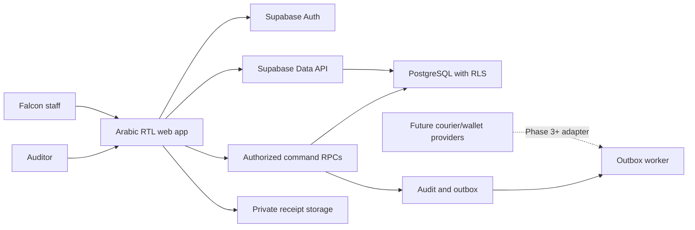
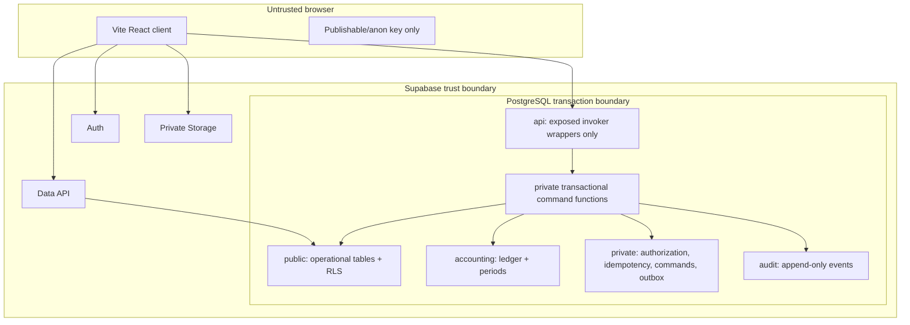

# Architecture

## Recommendation

Extend the existing Vite/React/TypeScript application. Use a local Supabase/PostgreSQL backend with migration-managed schemas and transactional RPC commands. Preserve current shipping-label UI during Phase 2; do not introduce Next.js solely for backend work.

## Context

## Containers and schemas

The `accounting`, `private`, and `audit` schemas are not exposed through the Data API. The exposed `api` schema contains only thin `SECURITY INVOKER` wrappers; they call specifically granted private implementations. Application roles receive `USAGE`/`EXECUTE` only for the exact private functions required by those wrappers, and PostgREST does not expose `private` directly. Operational `public` tables use RLS. Storage metadata is managed through the Storage API.

## Major components

- Identity/authorization helpers with database role assignments.
- Operational services for customer/catalog/order/printing/inventory/shipping.
- Payment, wallet, expense, payroll, partner, and approval commands.
- Ledger posting engine and posting mappings.
- Period close/distribution engine.
- Audit/idempotency/outbox infrastructure.
- Security-invoker reporting views or private report RPCs.
- Generated TypeScript database types and money serialization helpers.

## Client/server boundaries

The client may read and edit low-risk operational drafts through RLS. It cannot post/reverse journals, mark financial delivery directly, settle courier/supplier balances, approve payroll/withdrawals, close periods, or mutate audit logs. Those operations call authenticated RPC commands that re-read current role assignments and lock source rows.

## Authentication and authorization flow

1. Supabase Auth establishes identity.
2. RLS or command reads current profile and effective role assignments from database tables.
3. Policy checks organization, assignment/ownership, and capability.
4. Sensitive command additionally checks SoD, approval, current source state, and optional session controls.
5. Transaction writes operational state, journal, audit, idempotency result, and outbox atomically.

User-editable metadata is never an authorization source. App metadata can only be a non-authoritative cache.

## Transaction and concurrency strategy

- One RPC transaction per financial command.
- Derive the accounting date in Cairo and lock the matching `accounting.accounting_periods` row `FOR UPDATE` before any posting check. The close command acquires that identical row lock before final reconciliation and status change, so posting and close serialize.
- Acquire source/aggregate rows in deterministic order with `FOR UPDATE` after the period lock.
- Partner withdrawal commands lock the stable partner row before calculating the rolling aggregate. The aggregate counts submitted, approved, and executed requests created in the preceding 24 hours; rejected/cancelled/expired requests do not count.
- Use unique constraints for source posting purpose and idempotency scope.
- Use version columns for editable aggregates and reject stale versions.
- Compute totals from locked rows; never accept authoritative totals from the client.
- Roll back all operational, ledger, audit, and outbox writes on any error.

## Idempotency strategy

`private.command_executions` stores organization, command type, idempotency key, canonical request hash/version, actor, status, result/error reference, correlation ID, and timestamps. A unique `(organization_id, command_type, idempotency_key)` claim is inserted at transaction start; concurrent inserts wait on that unique row. After the winner commits, same key/hash replays its terminal outcome and same key/different hash fails. Business-validation failures may be caught in a PL/pgSQL subtransaction so business writes roll back while a sanitized terminal failure is stored. Unexpected database failures roll back the claim and are safe to retry. Source-level unique constraints provide a second guard against duplicate delivery, settlement, payroll, withdrawal, and reversal posting.

## Attachment strategy

Use private buckets separated by sensitivity where useful. Object path includes organization and parent record ID but is not authorization by itself. Store metadata, checksum, MIME type, size, uploader, parent, classification, and retention/hold. RLS/policies authorize through the parent record. Serve short-lived signed URLs; never expose service-role keys.

## Reporting strategy

Financial reports derive from posted journal lines and control-account reconciliations. Operational views join snapshots for dimensions. Exposed views use invoker security; sensitive or complex reports use authorized RPCs. Every report carries as-of/period, currency, and freshness information.

## Backup and recovery assumptions

Production RPO/RTO remain open. Before production: enable managed backups/PITR appropriate to approved objectives, export migration history and storage inventory, test restore to isolated staging, verify checksums/row counts/trial balance, and rehearse credential rotation. Local reset is not a production recovery mechanism.

## Proposed deployment

Phase 3 may deploy static Vite assets to a controlled web host and Supabase in an approved region/project, with separate local/staging/production projects, environment-specific publishable keys, CI migration checks, manual production migration approval, monitoring, backups, and no browser service key. No deployment occurs in Phase 1 or 2.

## Technology rationale

- Existing Vite/React app is reusable and avoids an unjustified framework migration.
- PostgreSQL constraints/transactions/RLS place financial and security invariants at the data boundary.
- Supabase provides Auth, Data API, Storage, CLI, and local reproducibility while retaining SQL as source of truth.
- TypeScript and generated types reduce client contract drift; SQL/pgTAP tests verify what TypeScript cannot.
