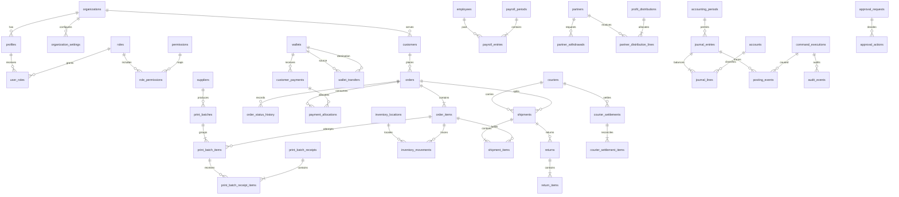

# Database Relationship Map

The model is organization-scoped even though Phase 2 seeds one Falcon organization. UUID primary keys are used for business entities; accounting lines use UUIDs as well for uniform audit references. All financial amounts are signed or non-negative `bigint` EGP minor units as constrained by context.

## Ownership Boundaries

- `public`: organization-filtered operational records. Direct financial writes are withheld.
- `accounting`: periods, chart of accounts, journals, posting events, close and distribution accounting records. Not exposed by Data API.
- `private`: authorization helpers, command execution, idempotency, outbox, and implementation functions. Never exposed.
- `audit`: append-only security and financial event trail. Not directly exposed.
- `api`: narrow, explicitly granted command wrappers and safe reporting access; no source-of-truth tables.

## Critical Cardinalities

- An order item can have many production attempts, shipment items, return items, and inventory movements.
- An order can have many payments through allocation rows, and a payment can be allocated across orders.
- A shipment and return are itemized, allowing partial delivery and partial return without inferring from order header state.
- One business event maps to at most one posting event for an event key, while one command may create multiple journals.
- A posted journal has at least two lines and belongs to exactly one accounting period.
